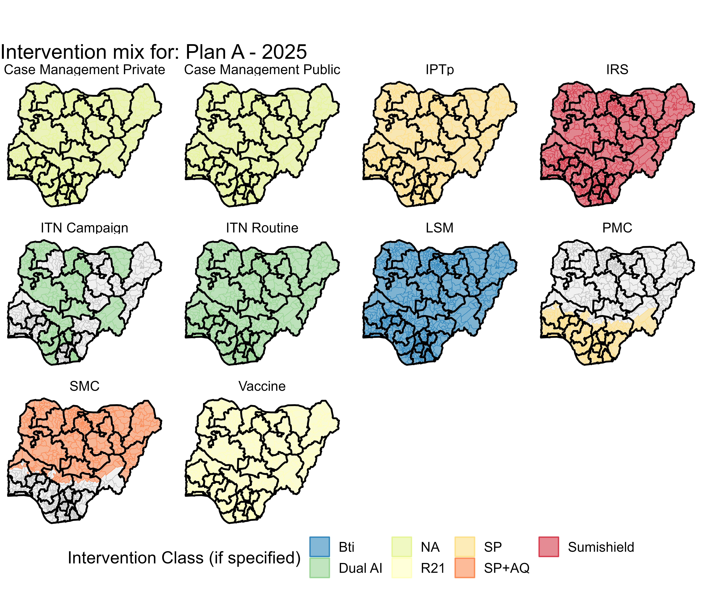
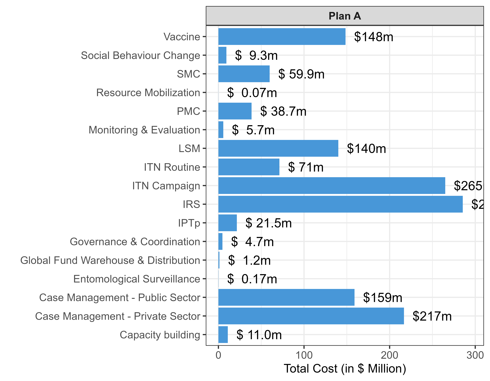

**Authors:** `r params$authors_list`

**Date of Generation:** `r Sys.Date()`

***\< Draft example to be completed in collaboration with partners and colleagues \>***

## Introduction

The following report provides a summary of the methods and results from the Budget generation exercise in Nigeria in response to the upcoming GC8 and NSP planning cycles.

The following plans are summarised in this document:

-   `r paste(params$plan_select, collapse = " ")`

Costs are reported in `r params$currency_select`.

## Methods

*summarise methods used for budget generation including* *intervention quantification assumptions/ description of unit cost methodology generation/ conversion of unit cost to total budget*

e.g. ITNs were quantified assuming 1.8 nets needed per person with a 10% buffer.

...

## Results

In this section we will include key results from the budget generation process.

The following interventions were budgeted for the year 2025. (Figure 1). The associated cost of each intervention and support servics are shown in Figure 2. The total estimated budet needed for this plan is \$1.25 billion.

## Key Considerations/ Limitations

By design this process is challenging and some of these can be listed here..

## References

## Acknowledgements
